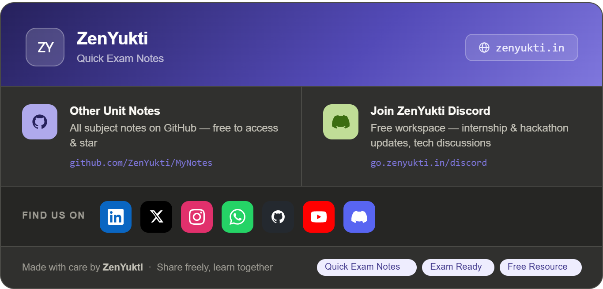

# 🌱 Spring Framework & Spring Boot — Exam Notes

---

## 1. Spring Core — Key Concepts

Spring is a **lightweight, loosely coupled** Java framework built around two core principles:

### Inversion of Control (IoC)
- Instead of the object creating its own dependencies, **Spring creates and manages them**.
- You give control of object creation to the **Spring IoC Container**.

### Dependency Injection (DI)
- The process by which IoC is implemented.
- Spring **injects** dependencies into a class rather than the class creating them.

**3 Types of DI:**

| Type | How |
|---|---|
| Constructor Injection | Via constructor args |
| Setter Injection | Via setter methods |
| Field Injection | Via `@Autowired` on field |

```java
// Constructor Injection (recommended)
@Component
public class Car {
    private Engine engine;

    @Autowired
    public Car(Engine engine) {
        this.engine = engine;
    }
}
```

---

## 2. AOP — Aspect Oriented Programming

Used to separate **cross-cutting concerns** (logging, security, transactions) from business logic.

| Term | Meaning |
|---|---|
| **Aspect** | The module containing cross-cutting logic |
| **Advice** | Action taken (Before, After, Around) |
| **Join Point** | Point in execution (method call) |
| **Pointcut** | Expression selecting which join points |

```java
@Aspect
@Component
public class LoggingAspect {
    @Before("execution(* com.app.service.*.*(..))")
    public void logBefore() {
        System.out.println("Method called!");
    }
}
```

> **Advice types:** `@Before`, `@After`, `@AfterReturning`, `@AfterThrowing`, `@Around`

---

## 3. Bean Scopes

| Scope | Description |
|---|---|
| **Singleton** | (Default) One instance per Spring container |
| **Prototype** | New instance every time bean is requested |
| **Request** | One per HTTP request (web apps) |
| **Session** | One per HTTP session |
| **Application** | One per ServletContext |
| **WebSocket** | One per WebSocket session |

```java
@Component
@Scope("prototype")
public class MyBean { }
```

---

## 4. Autowiring

Spring automatically resolves and injects bean dependencies.

```java
@Component
public class Service {
    @Autowired
    private Repository repo; // Spring finds and injects the Repository bean
}
```

**Autowiring modes (XML):** `no`, `byName`, `byType`, `constructor`  
**Annotation:** `@Autowired` (byType by default); use `@Qualifier` when multiple beans of same type exist.

```java
@Autowired
@Qualifier("mysqlRepo")
private Repository repo;
```

---

## 5. Key Spring Annotations

| Annotation | Purpose |
|---|---|
| `@Component` | Generic Spring-managed bean |
| `@Service` | Service layer bean |
| `@Repository` | DAO layer bean |
| `@Controller` | MVC Controller |
| `@Autowired` | Auto dependency injection |
| `@Qualifier` | Specify which bean to inject |
| `@Scope` | Define bean scope |
| `@Bean` | Declare bean in config class |
| `@Configuration` | Mark class as config source |
| `@ComponentScan` | Tell Spring where to scan for components |

---

## 6. Bean Lifecycle Callbacks

Spring bean lifecycle: **Instantiate → Populate Properties → Init → Use → Destroy**

```java
@Component
public class MyBean implements InitializingBean, DisposableBean {

    @PostConstruct
    public void init() { System.out.println("Bean initialized"); }

    @PreDestroy
    public void destroy() { System.out.println("Bean destroyed"); }
}
```

> `@PostConstruct` → called after DI; `@PreDestroy` → called before bean removal.

---

## 7. Bean Configuration Styles

### XML-based (Legacy)
```xml
<bean id="engine" class="com.app.Engine"/>
<bean id="car" class="com.app.Car">
    <constructor-arg ref="engine"/>
</bean>
```

### Annotation-based
```java
@Component, @Service, @Autowired — as shown above
```

### Java-based (Modern / Preferred)
```java
@Configuration
public class AppConfig {
    @Bean
    public Engine engine() { return new Engine(); }

    @Bean
    public Car car() { return new Car(engine()); }
}
```

---

---

# 🚀 Spring Boot

Spring Boot = Spring + **Auto-configuration + Embedded Server + Starters** (zero XML config)

---

## 8. Build Systems

| Tool | Config File |
|---|---|
| **Maven** | `pom.xml` |
| **Gradle** | `build.gradle` |

Maven starter dependency example:
```xml
<dependency>
    <groupId>org.springframework.boot</groupId>
    <artifactId>spring-boot-starter-web</artifactId>
</dependency>
```

---

## 9. Code Structure (Standard)

```
src/
 └── main/
      ├── java/com/app/
      │    ├── MyApplication.java      ← Entry point
      │    ├── controller/
      │    ├── service/
      │    ├── repository/
      │    └── model/
      └── resources/
           └── application.properties
```

```java
@SpringBootApplication  // = @Configuration + @ComponentScan + @EnableAutoConfiguration
public class MyApplication {
    public static void main(String[] args) {
        SpringApplication.run(MyApplication.class, args);
    }
}
```

---

## 10. Spring Boot Runners

Execute code **after** the application starts.

```java
// ApplicationRunner
@Component
public class MyRunner implements ApplicationRunner {
    public void run(ApplicationArguments args) {
        System.out.println("App started!");
    }
}

// CommandLineRunner
@Component
public class MyRunner implements CommandLineRunner {
    public void run(String... args) {
        System.out.println("App started!");
    }
}
```

> Use for: DB seeding, startup checks, initialization tasks.

---

## 11. Logger

```java
import org.slf4j.Logger;
import org.slf4j.LoggerFactory;

@RestController
public class MyController {
    private static final Logger log = LoggerFactory.getLogger(MyController.class);

    public void method() {
        log.info("Info message");
        log.error("Error occurred");
        log.debug("Debug info");
    }
}
```

Set level in `application.properties`:
```properties
logging.level.com.app=DEBUG
```

---

## 12. Building RESTful Web Services

### Key Annotations

| Annotation | Purpose |
|---|---|
| `@RestController` | `@Controller` + `@ResponseBody`; returns JSON/XML |
| `@RequestMapping` | Maps URL to class/method |
| `@GetMapping` | HTTP GET |
| `@PostMapping` | HTTP POST |
| `@PutMapping` | HTTP PUT |
| `@DeleteMapping` | HTTP DELETE |
| `@RequestBody` | Bind HTTP request body to object |
| `@PathVariable` | Extract value from URL path |
| `@RequestParam` | Extract query parameter from URL |

---

### Complete REST Controller Example

```java
@RestController
@RequestMapping("/api/students")
public class StudentController {

    // GET all → /api/students
    @GetMapping
    public List<Student> getAll() {
        return studentService.findAll();
    }

    // GET by ID → /api/students/5
    @GetMapping("/{id}")
    public Student getById(@PathVariable int id) {
        return studentService.findById(id);
    }

    // GET with query param → /api/students?name=John
    @GetMapping("/search")
    public Student search(@RequestParam String name) {
        return studentService.findByName(name);
    }

    // POST → /api/students  (body: JSON Student)
    @PostMapping
    public Student create(@RequestBody Student student) {
        return studentService.save(student);
    }

    // PUT → /api/students/5
    @PutMapping("/{id}")
    public Student update(@PathVariable int id, @RequestBody Student student) {
        return studentService.update(id, student);
    }

    // DELETE → /api/students/5
    @DeleteMapping("/{id}")
    public String delete(@PathVariable int id) {
        studentService.delete(id);
        return "Deleted successfully";
    }
}
```

---

### PathVariable vs RequestParam

```
/students/5          → @PathVariable  → part of URL path
/students?id=5       → @RequestParam  → query string after ?
```

---

## 13. application.properties (Common Config)

```properties
server.port=8080
spring.application.name=my-app
spring.datasource.url=jdbc:mysql://localhost:3306/mydb
spring.datasource.username=root
spring.datasource.password=secret
```

---

## Quick Summary: IoC vs DI vs AOP

| Concept | One-liner |
|---|---|
| **IoC** | Spring manages object lifecycle, not you |
| **DI** | Spring injects dependencies automatically |
| **AOP** | Separates logging/security from business logic |
| **Spring Boot** | Auto-config Spring app with embedded server |

---

## 🎯 5 Exam-Oriented Questions & Solutions

---

**Q1. What is the difference between IoC and DI?**

- **IoC** (Inversion of Control) = the *principle* — control of creating objects is given to the framework.
- **DI** (Dependency Injection) = the *implementation* of IoC — Spring injects required objects into your class.

> IoC is the concept; DI is how Spring does it.

---

**Q2. What is the difference between `@Component`, `@Service`, `@Repository`, and `@Controller`?**

All four are **Spring-managed beans** (specializations of `@Component`):

| Annotation | Layer | Extra Behavior |
|---|---|---|
| `@Component` | Generic | None |
| `@Service` | Business logic | None (semantic) |
| `@Repository` | Data access | Exception translation |
| `@Controller` | Web/MVC | Returns views |
| `@RestController` | REST API | `@Controller` + `@ResponseBody` |

---

**Q3. What are the different Bean Scopes and when to use them?**

- **Singleton** → Shared state, stateless services (default)
- **Prototype** → New instance needed every time (stateful beans)
- **Request** → Data per HTTP request (web forms)
- **Session** → Data per user session (shopping cart)
- **Application** → App-wide shared data
- **WebSocket** → Per WebSocket connection

---

**Q4. What is the difference between `@PathVariable` and `@RequestParam`?**

```java
// @PathVariable — value is part of the URL
@GetMapping("/students/{id}")
public Student get(@PathVariable int id) { ... }
// URL: /students/5

// @RequestParam — value is a query parameter
@GetMapping("/students")
public Student search(@RequestParam String name) { ... }
// URL: /students?name=John
```

---

**Q5. What is AOP and what are the types of Advice?**

**AOP** separates cross-cutting concerns (logging, auth, transactions) from business logic using **Aspects**.

| Advice | When it runs |
|---|---|
| `@Before` | Before method execution |
| `@After` | After method (always) |
| `@AfterReturning` | After successful return |
| `@AfterThrowing` | After exception thrown |
| `@Around` | Before AND after (most powerful) |

```java
@Around("execution(* com.app.service.*.*(..))")
public Object logTime(ProceedingJoinPoint pjp) throws Throwable {
    long start = System.currentTimeMillis();
    Object result = pjp.proceed();
    System.out.println("Time: " + (System.currentTimeMillis() - start));
    return result;
}
```

---

*You've got this — go ace it! ☕🚀*

Brought to you by Team ZenYukti

